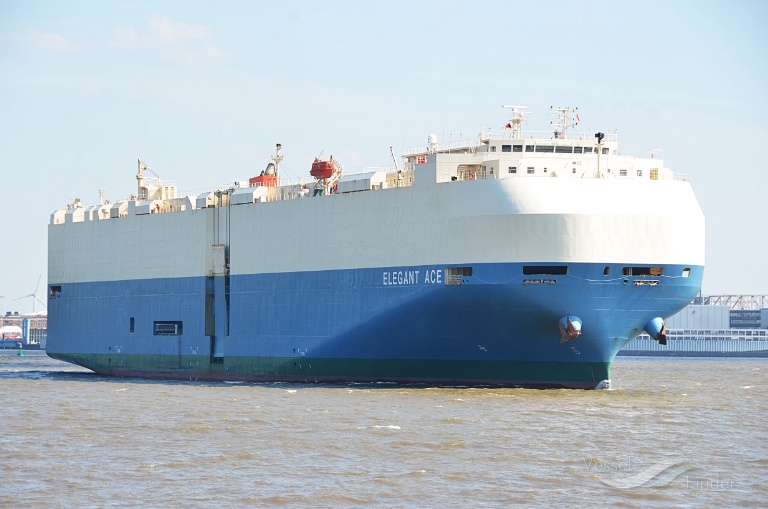

+++
date = '2025-08-05T14:20:14-04:00'
title = 'At Sea'
+++

My bill of lading arrived. That means I have a ship, [Elegant Ace](https://www.vesselfinder.com/vessels/details/9561265), which will carry the truck across the Pacific, through the Panama canal, an ultimately to Baltimore. 

This also means I need to get the import paperwork in order. The process has been a bit confusing, with the company facilitating the sale giving me mixed recommendations - either doing paperwork myself with the help of easyISF, or using a broker. I ended up using a broker, but not sure if that was the best choice.

