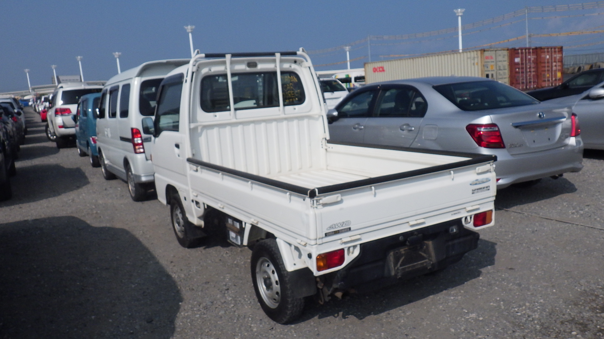
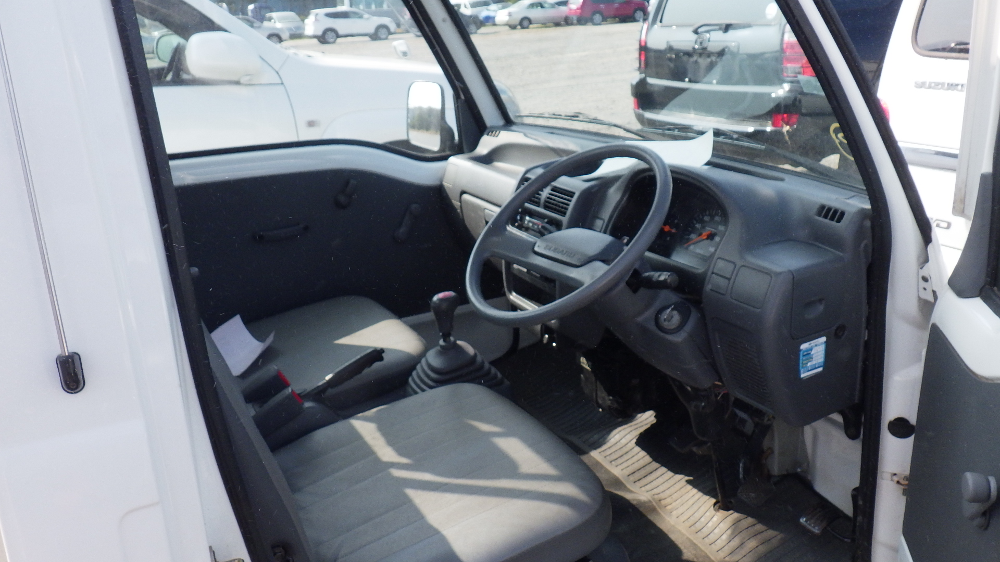

+++
date = '2025-07-31T14:20:14-04:00'
draft = true
title = 'Auction Winner!'
+++

I won an auction. It took a few attempts and false starts, but I won the auction for a 1998 Subaru Sambar KS4. Manual transmission, A/C, and apparently pretty good exteror and interior condition - and at just under 30K kilometers on the dial.

The process: I used Japan Car Direct as the facilitator/agent. After signing up, a lot of the process was via Whatsapp, where they would show potential upcoming auction vehicles that meet my general criteria, and I'd give feedback on which I was willing to potentially bid on. On auction day, they would order same-day third party inspections. I had to be pretty available at that time for feedback (usually Thursday or Friday night in East-coast US time to correspond to Friday or Saturday morning auctions in Japan). When the inspection came back good, I gave the thumbs up and a ceiling amount to bid, and they carried it out.

I won at 454K Yen. The various fees for the auction, agent suppport, and transport fees to the US got that up to about $880k Yen total, or $6217 USD.

They sent some pictures of the truck in the yard.

