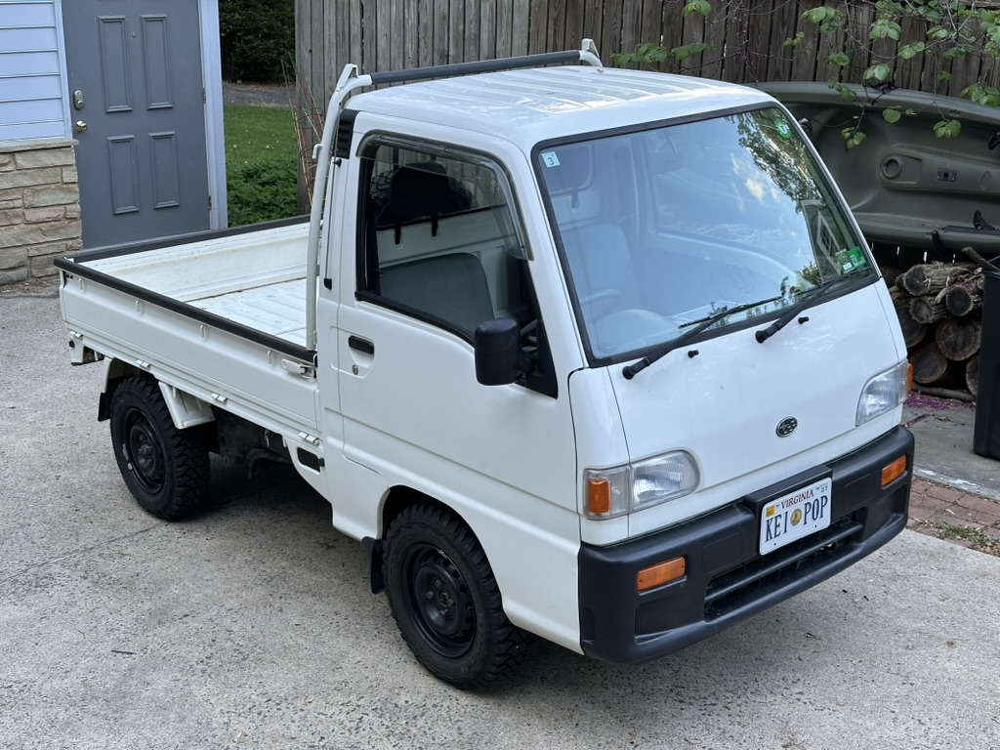
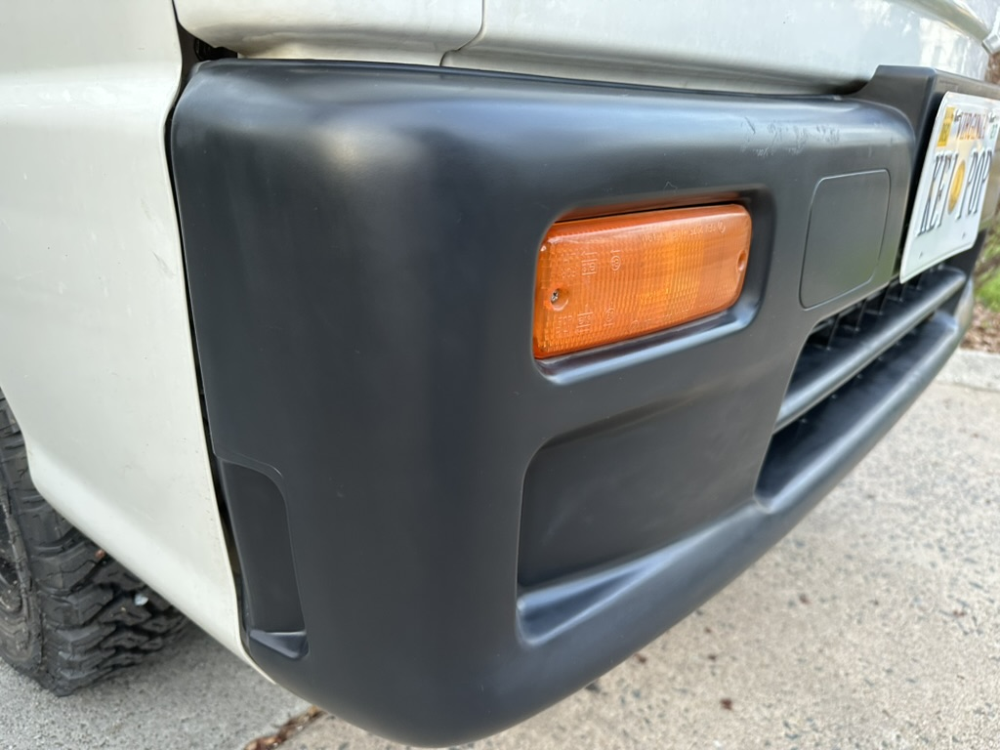

+++
date = '2026-03-24T00:00:00-04:00'
title = 'Bumper Touchup'
+++

When I got my truck, a fellow Sambar owner recommended this [trim restorer](https://www.amazon.com/dp/B00IOMDUN0?ref_=ppx_hzsearch_conn_dt_b_fed_asin_title_1&th=1) to get the front bumper back to black instead of a faded gray.

It did a good job and after a couple months has been looking good. We'll see how much it fades back over time.

## Original Condition

## After Restorer

