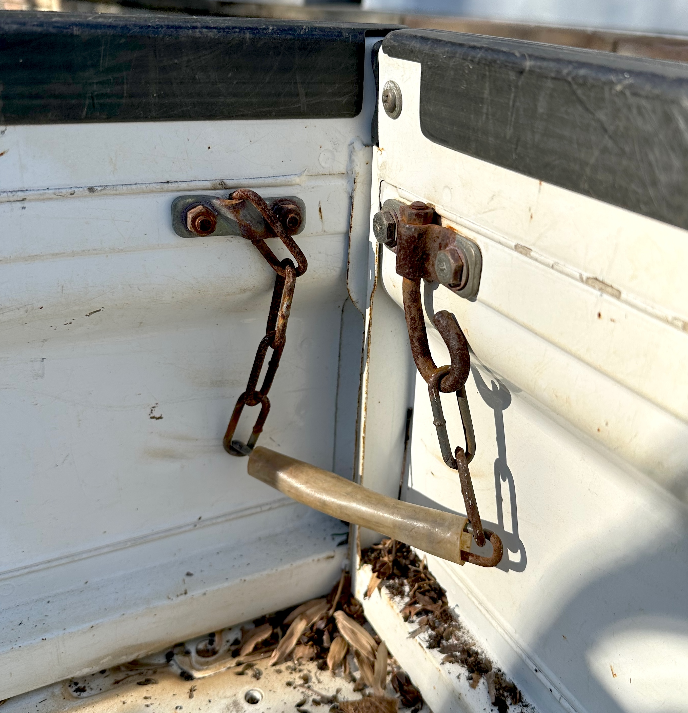
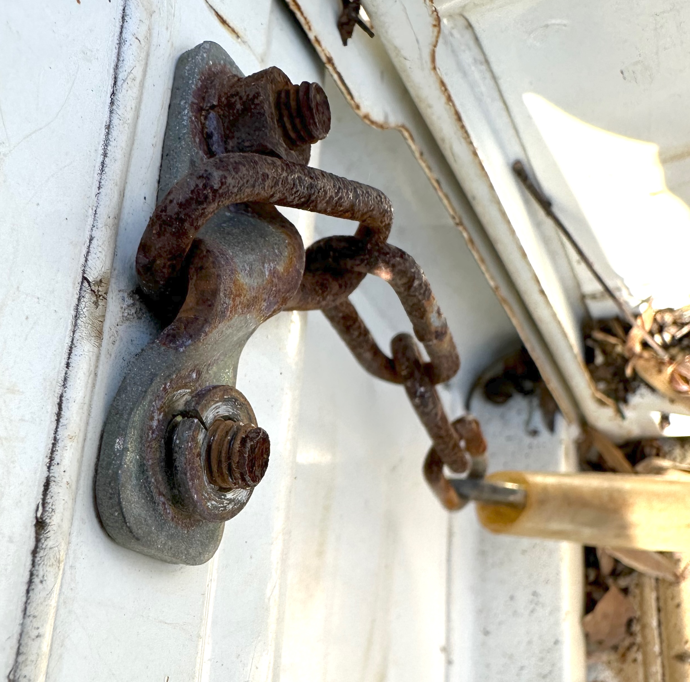
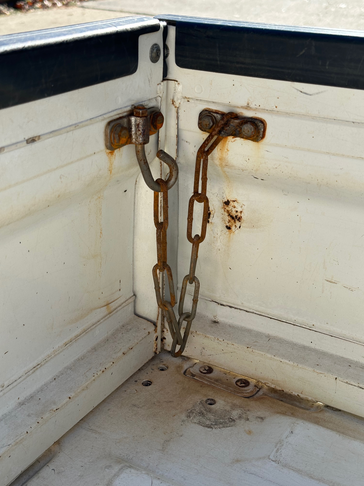
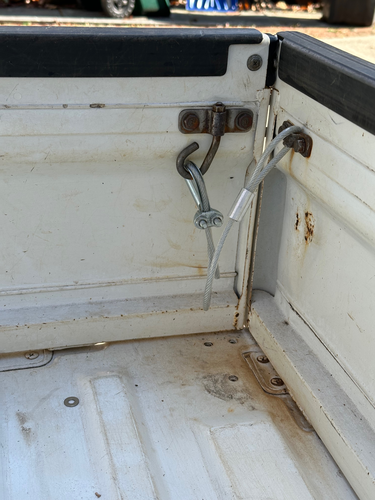
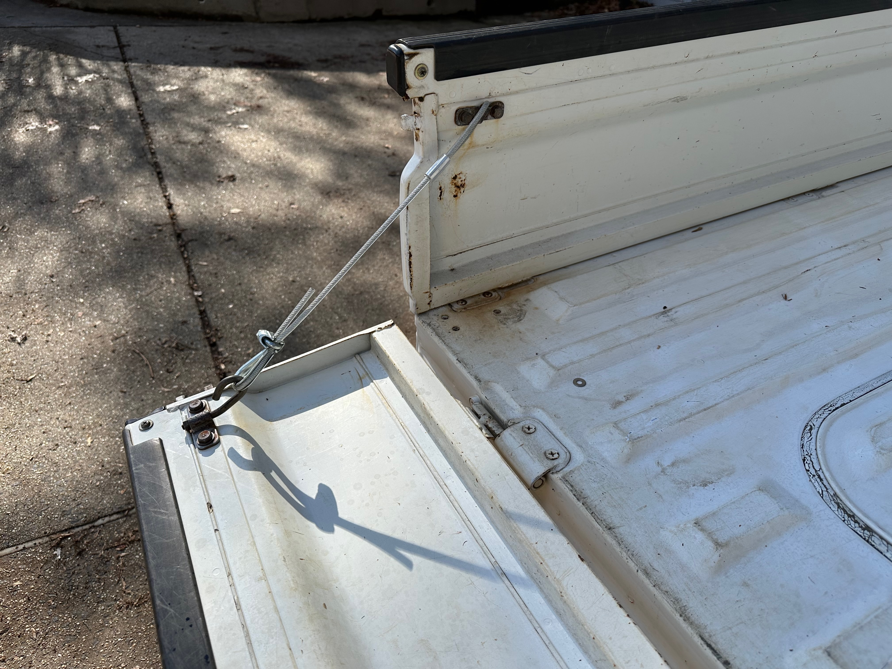

+++
date = '2026-01-11T00:00:00-04:00'
title = 'Gate Chains'
+++

The chains that hold up the tailgate were pretty well rusted... entirely functional but cosmetically poor.

My first, simple effort was to soak them in vinegar and salt. I let them sit for a good 24 hours, then used some steel wool, and also a rotary wire brush (i.e. use as a drill bit on a cordless drill). That helped, but didn't work miracles, so I did a second round of the same.

All of that effort resulted in better, but not great.

I had some excess cable lying around, so I tried that. I'm happy enough with it. The only problems are:

* It doesn't droop as well as the chain, so things twist up slightly. That's not a big deal but it can work itself off the hook easily when opening.
* Using the original bracket (on the non-hook side-gate end) will probably eat away the plastic coating on the cable and then lead to rust on the cable.

So I think this will work well for a while. I'll call it a B+ solution. If I come back to it, I'll look for an alternate bracket type on the side wall, maybe even something that could double as a tie-down point.
