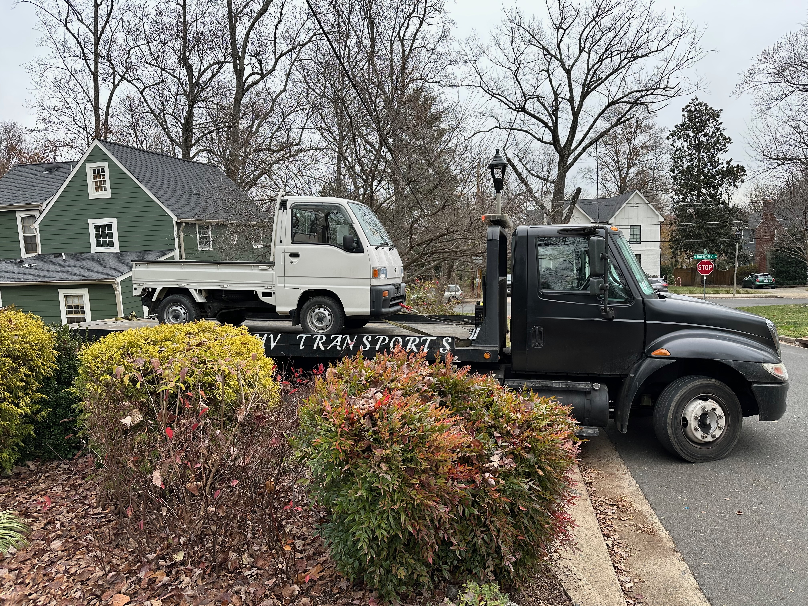

+++
date = '2025-12-08T00:00:00-04:00'
title = 'Homecoming'
+++

It's home! It was a chaotic process. I get a voicemail late Friday that the port escort tried to start the car. They tried to jump it, add gas, and enlist the help of the port mechanic to no avail. No answer when I tried to call back, so now instead of planning to leave Monday morning, I have to plan to call them first thing to understand how to proceed.

One step I took was to google search for a car hauling company. I found some form to fill out for a quote. As I suspected, it basically just became a bunch of text message spam from a number of middlemen booking companies. (Fortunately, I used my google voice number for the form.) The website I found was basically a middle-middle man who then sells leads to a bunch of these booking firms. None of them operate trucks - they give you a quote and then call around and try to make it happen. Not exactly a scam, but feels like a pretty shady corner of the business world.

Monday morning first thing I called the port escort. They did have a tow truck with a winch that they recommended. I call that guy, but he doesn't go to Virginia. He referred me to his friend... who doesn't like to answer phones or text it seems. So as this option dries up, I'm actually relieved I have all those spam text messages that I am now going back to... "Can you pick up from the port today? Does your driver have a TWIC card?" I get one that had quoted me $120 so I talk to him. He says the winch service will make it $200. (Fine.) So I sign the contract. Back to the fact that these aren't real towing companies, he then calls back in an hour that someone can do it the next day for $350. I say no... this goes on for some time and he finally finds someone who can do it same day for $300. Good enough.

Ultimately, instead of a field trip to the port, I was on the phone all day like a dispatcher texting and calling with the tow broker companies, the port escort, and my customs broker. Half of the day I'm waiting for some news from one of them like a 1950's expectant father in the waiting room.

The last text I get is from the driver "ETA within the hour" and I was finally able to breathe a little.

I still now have the worry of how I - not a mechanic by any stretch - will deal with a car that isn't starting. I start watching youtube videos on sambar troubleshooting.

When the truck finally arrives, I have him put it in the driveway, where with gravity and some gentle pushing, I roll it into my garage. The driver is 20 questions about the truck and wants to know more. (Of course he does, the sambar is a charming little guy.)

## Epilogue: Ignition!

Tuesday night, I decide to just give it a more earnest try to start the beast up. I pump the gas and keep the ignition going, ultimately flooring it, just as I'm convinced I've flooded it, it starts up! I push it out of the garage a bit to avoid fumigating myself and let it run for 15 minutes or so. Then the next day, it started up just fine, and has ever since.

