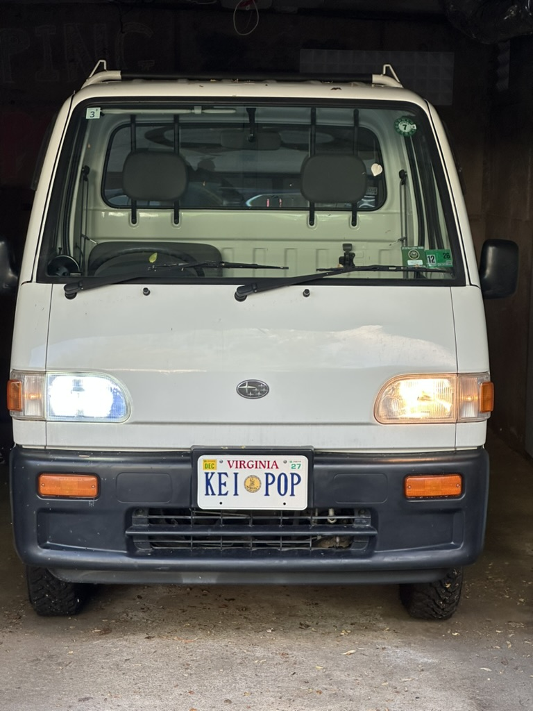
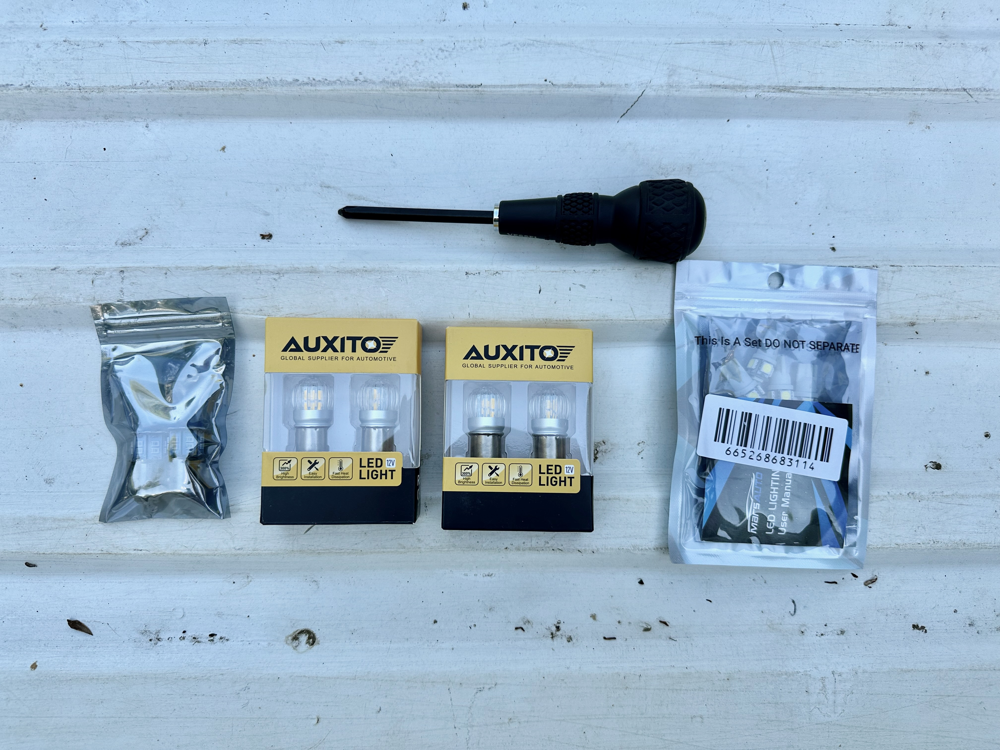
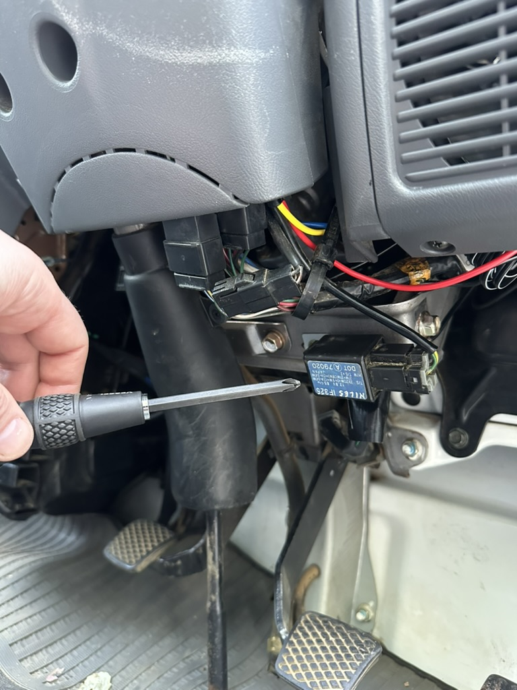
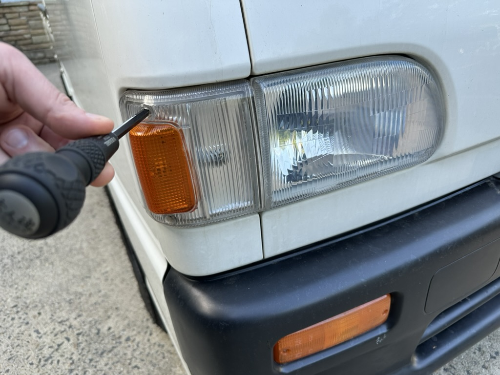
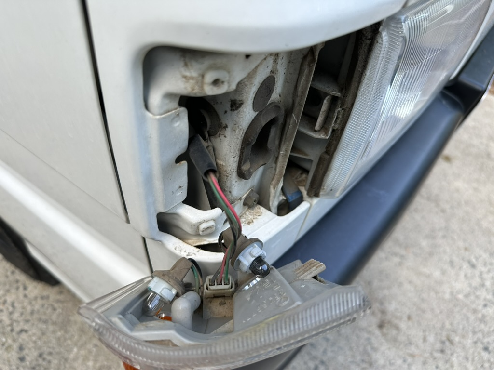
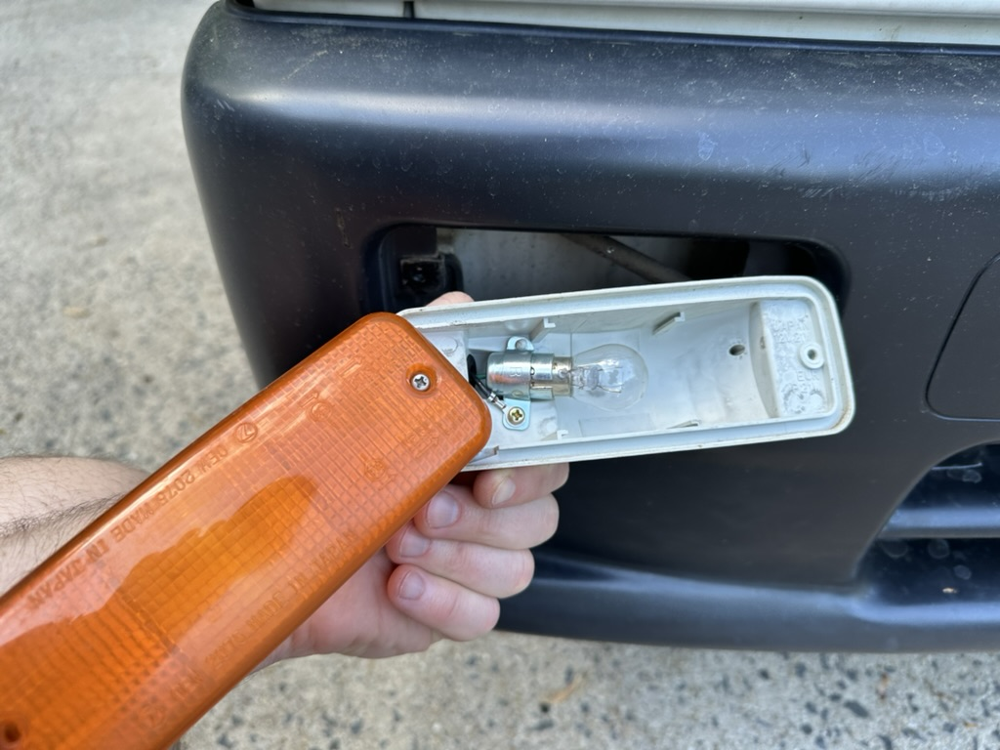
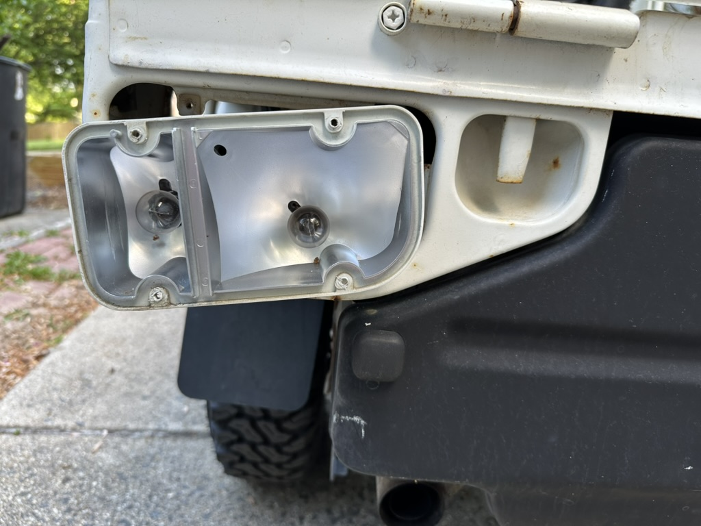
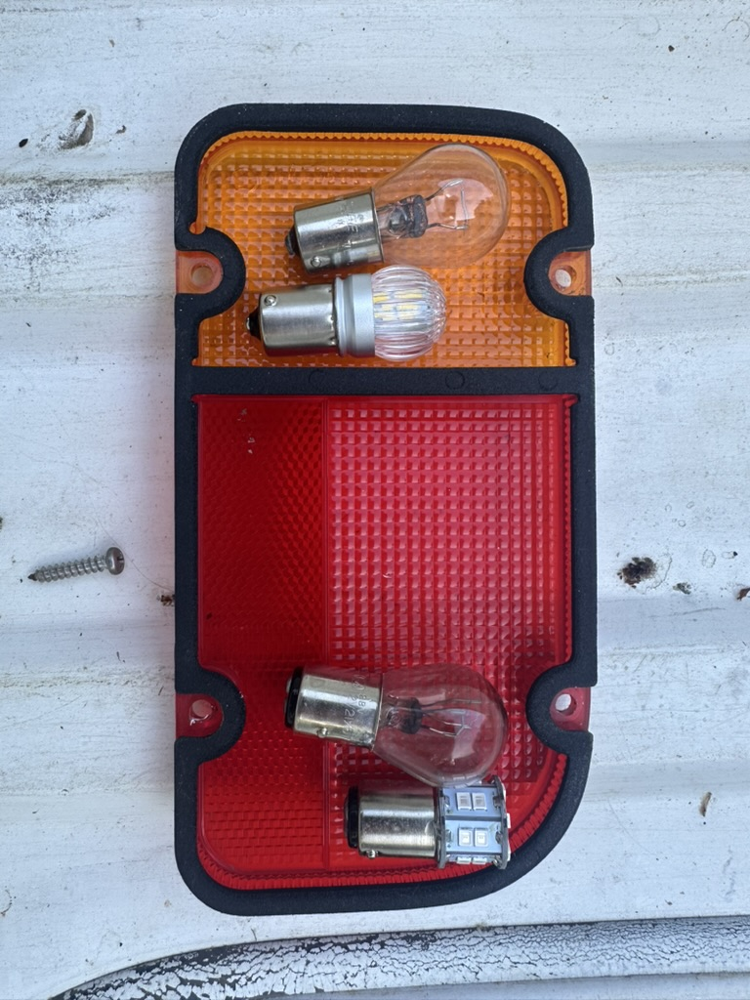
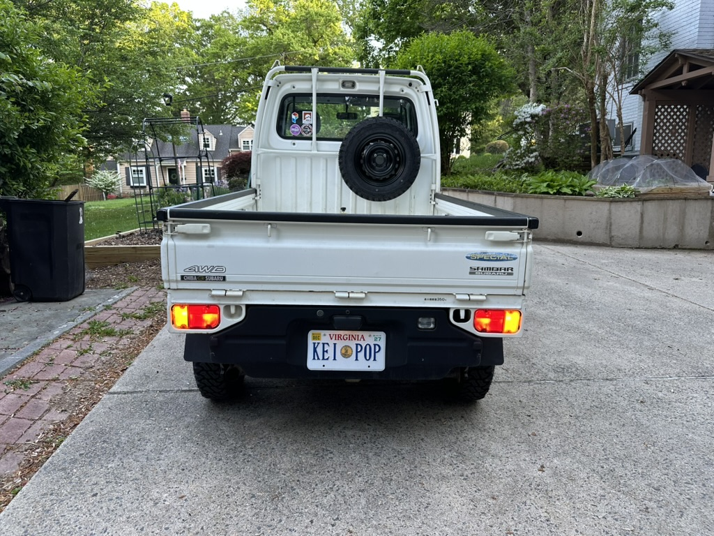

+++
date = '2026-04-19T00:00:00-04:00'
title = 'LED Lights Swap'
+++

I felt compelled to swap out most of the exterior lighting for LEDs, and also converting the bed light to a 3rd brake light. I didn't have any bulbs out, but liked the idea of better visibility for safety reasons and less strain on the electrical system.

## Bed/Brake Light Conversion

This was probably the most important item from a safety perspective. You can [buy a simple kit](https://www.etsy.com/listing/1863118587/subaru-sambar-3rd-brake-light-and-bed) to convert the exterior bed light into a combo 3rd brake light and bed light. Install was straightforward [following this video](https://www.youtube.com/watch?v=hkCtxVjlPOg), though my kit shipped with a pretty convenient wiring kit so I didn't need to use any T-taps, etc. A word of caution, I wasn't too careful and initially snipped a wrong wire under the dash - so had to do a bit of repair. 

## Headlights

I basically followed the [Oh Kei Garage video](https://www.youtube.com/watch?v=Ahao4yHcv6w) on how to do this. I would have bought the bulbs from them, but they were out of stock so I [got them on Amazon instead](https://www.amazon.com/dp/B0FFSM2JCC?ref_=ppx_hzsearch_conn_dt_b_fed_asin_title_2&th=1). I believe about any H4 replacement bulb would work. Installation was pretty straightforward following the video. When removing the rubber gasket, definitely finding the pull tab is critical (took me a moment for the first one). I also had a little trouble getting the spring to set right when re-assembling the second one.

## Secondary Lights

The other lights were very straightforward to access - just a screwdriver from the outside of the car.

| Location | Bulb |
| ---- | ---- |
| Front yellow indicator (on bumper) | [p21 12v 21w](https://www.amazon.com/dp/B08QHX95B2?ref_=ppx_hzsearch_conn_dt_b_fed_asin_title_4&th=1) |
| Front corner indicator | [T10](https://www.amazon.com/dp/B079L3WBDN?ref_=ppx_hzsearch_conn_dt_b_fed_asin_title_3&th=1) |
| Front corner running light | [T10](https://www.amazon.com/dp/B079L3WBDN?ref_=ppx_hzsearch_conn_dt_b_fed_asin_title_3&th=1) |
| Rear signal | [p21W 12v 21w](https://www.amazon.com/dp/B08QHX95B2?ref_=ppx_hzsearch_conn_dt_b_fed_asin_title_4&th=1) |
| Rear tail/brake light | [p21 12v 21/5w](https://www.amazon.com/dp/B0F7RGDHY5?ref_=ppx_hzsearch_conn_dt_b_fed_asin_title_4&th=1) |

I wasn't able to easily get the cover off of my reverse light, so I didn't replace that.

## Flasher Relay

Once I installed all of these, my turn signals were blinking very fast. This is because the low voltage makes the original flasher relay think that a bulb is burned out.

After some quick research, I ordered an [LED Flasher Relay](https://www.amazon.com/dp/B0CBH7BT2X?ref_=ppx_hzsearch_conn_dt_b_fed_asin_title_1&th=1). 
Note the orientation of the "L", "B", "E" connectors is different on some models, so make sure it matches the factory unit.

You can find the unit by turning on your turn signal and following the sound of the clicks. You can feel the physical switching/clicking on the relay unit (just below the steering wheel and very easy to access). The replacement unit had a slightly different shape so it didn't mount back the same way precisely, but I was able to use the original metal bracket and some 2-sided tape to make it work well.

## More Photos

