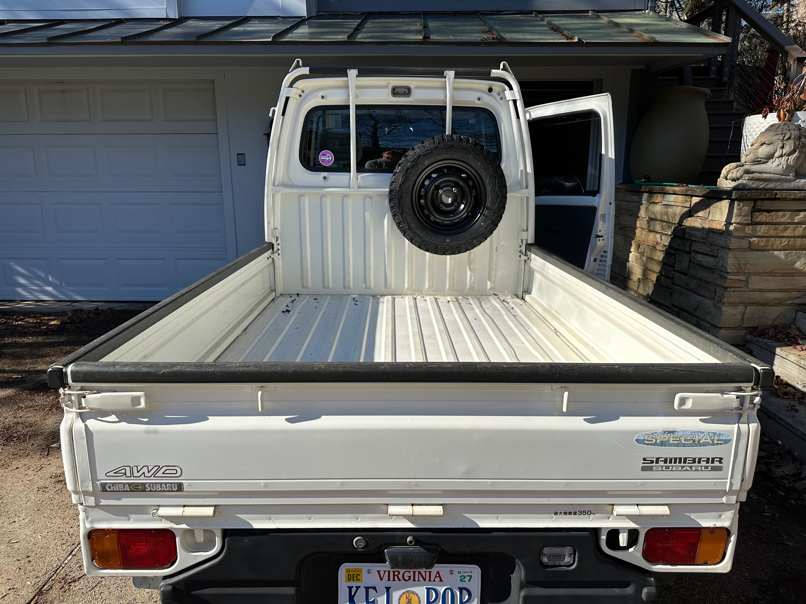
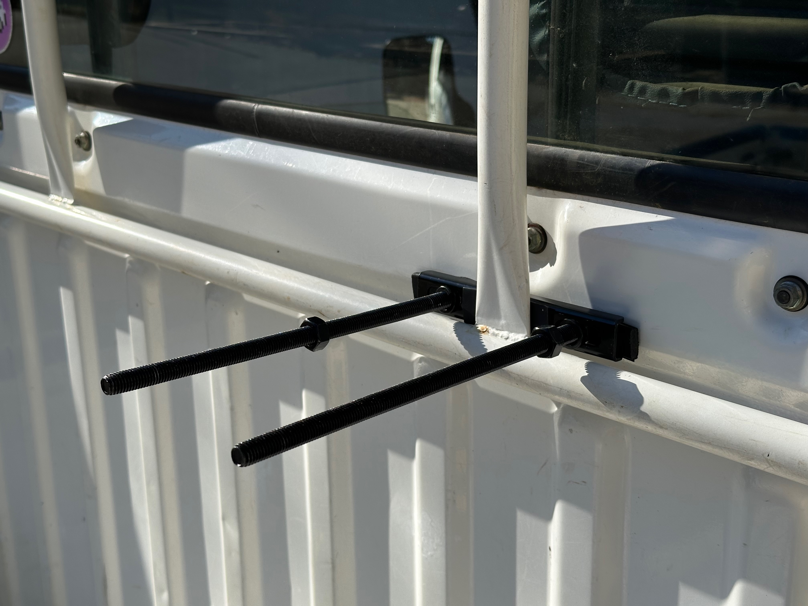
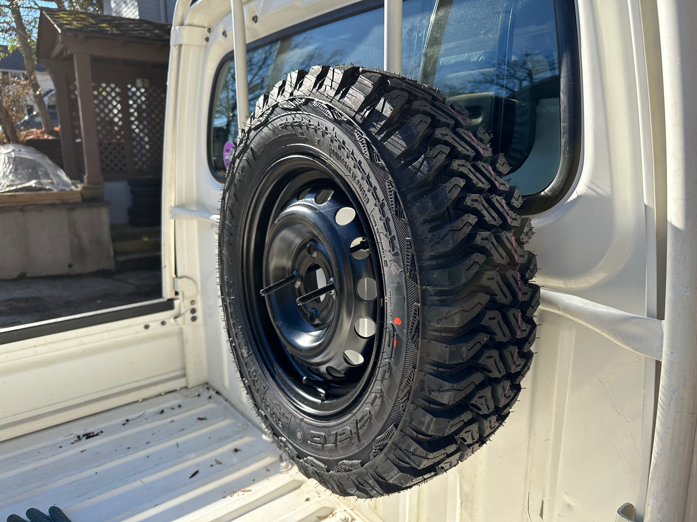
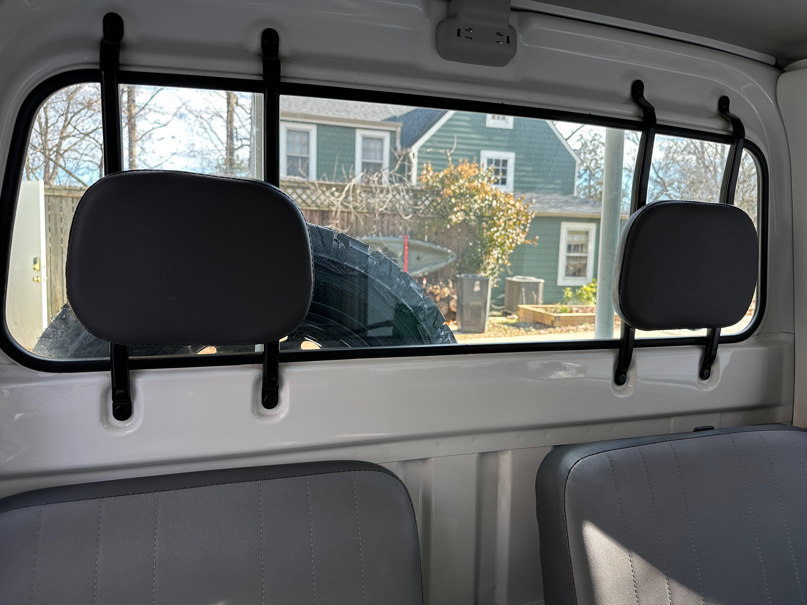

+++
date = '2026-01-11T00:00:00-04:00'
title = 'Spare Tire Mount'
+++

In my [new wheels & tires](/posts/wheels/) project, I had opted for 5 new wheels/tires with the thought that I wanted a full size spare. I knew the larger tires would likely not fit in the standard under-bed spare location; and indeed it didn't fit. My thought was to mount the spare either on a roof rack or on the back of the cab... and I am first trying out the latter.

Overall, I'm calling this a C+ project - not quite all I had hoped, and I may ultimately stuff one of the old original wheels/tires in the spare slot.

I ordered a [simple mount that is meant for the side of a trailer](https://www.amazon.com/dp/B0D9QL3CND?ref=ppx_yo2ov_dt_b_fed_asin_title&th=1) to mount that to the rear headache rack. Here's what it looks like completed from afar. I'm happy with the general position - it doesn't encroach on the window visibility too much and leaves some room for longer items to use the full bed depth.

The initial mounting was pretty simple. Even though the bracket hardware is pretty thin, it still took a little doing to finesse it between the rack and cab. I had also inserted some rubber strips to lessen metal-on-metal contact.

My first frustration, perhaps not too surprising given the simplicity of the mount, is that it has these two bolts bearing the entire weight of the tire, so it all sags down a bit. I'm not sure what kind of stress that puts on the bolt, and it if may bend/break over time. You can see the angle decently well in this photo. Also, it is a lot of effort with a wrench to put the locking bolts all the way down the rather long bolt, so I'm not sure how practical it is - it would take easily 5-10 minutes to get those off if you had an actual tire change scenario; and I'm concerned that if the bolts bend some, it could make that more difficult.

Below is the view from inside the cab. It does slightly hinder your "backing up" view, but not drastically, and does show up a bit in the rearview mirror.

