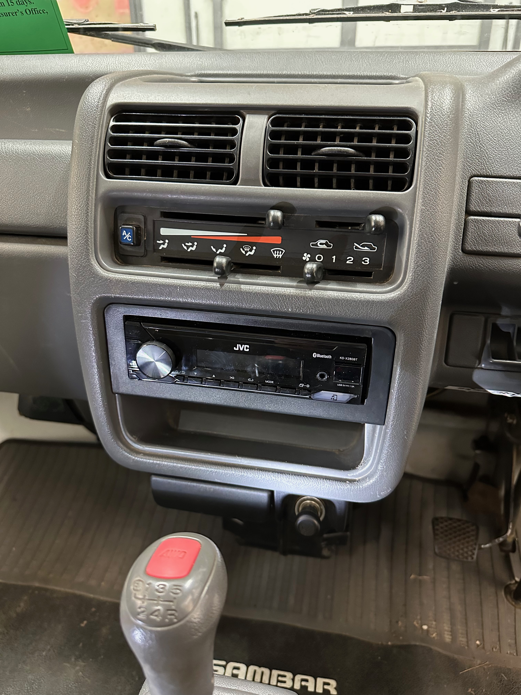
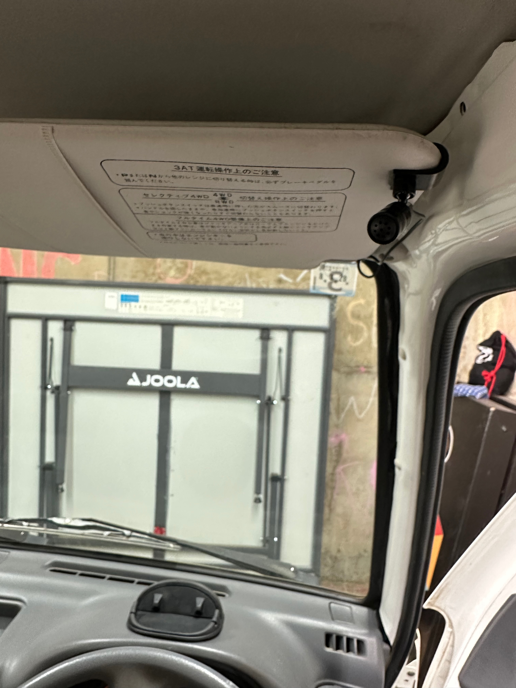
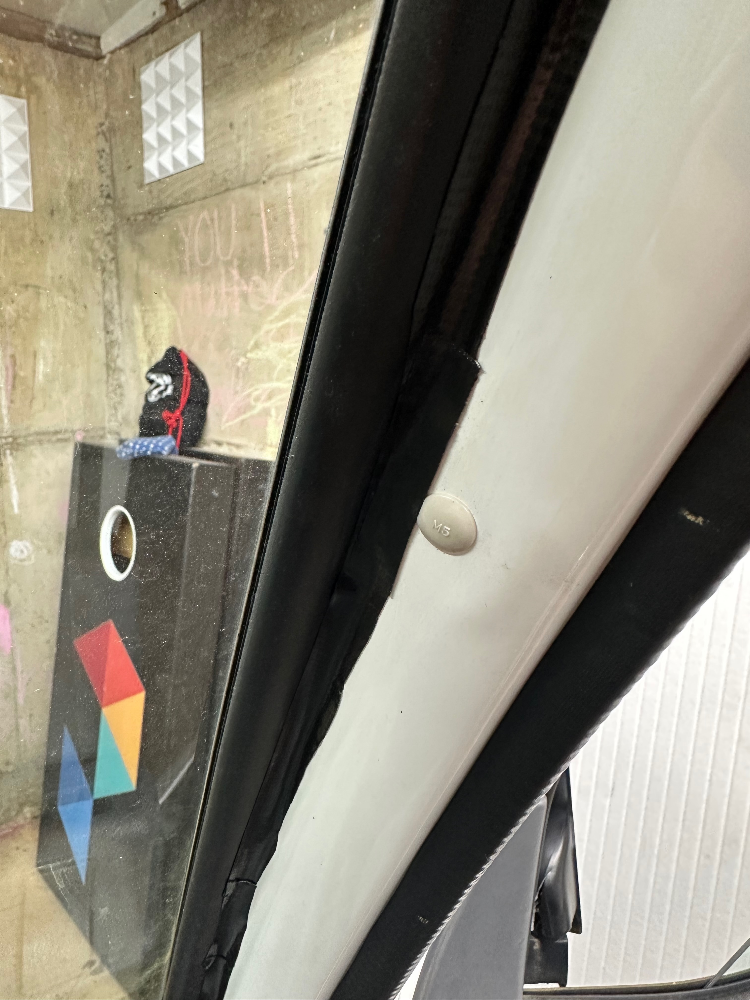
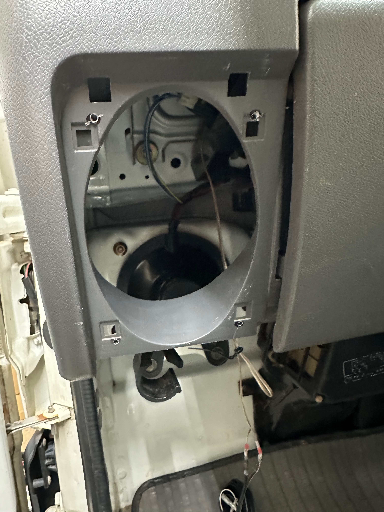

+++
date = '2026-01-06T00:00:00-04:00'
title = 'Stereo Upgrade'
+++

The stereo replacement was the first project I really started, but took a while to complete. The issue I ran into was finding speakers that would gracefully fit inside the factory speaker grill in the dash. 

## Head Unit

I opted for a fairly simple and cheap unit, the [JVC KD-X280BT](https://www.crutchfield.com/p_105KDX280B/JVC-KD-X280BT.html) ($97.98), which has basic radio plus modern bluetooth capabilities. It is a single-DIN "digital media receiver" - meaning that it is a normal thin height and is also not too deep, as it doesn't need to accomodate CDs/DVDs. It is essentially identical in dimension to the factory unit.

It was pretty simple to get the factory cover off, then find the 4 screws to unmount the bracket. Two of the screws are pretty deep and required a longer screwdriver, so a little harder to work with. The new stereo came with an optional quick-release bracket (to remove the radio without screws), but that didn't seem to fit gracefully, so I just installed it in the traditional manner.

I did watch the [how-to video from Oh Kei Garage](https://www.youtube.com/watch?v=K195toB0WKA), which was helpful to understand what to expect.

I know Oh Kei Garage has a wiring harness, which would have been nice, but I just matched up wires and used a heat gun and heat shrink self-solder connectors, using the [KS4 manual](https://oiwa.co/subaru-sambar-manual) to help me sort out which wires to connect to which.

If I did it all over, I'd consider going with a [RetroSound option](https://www.crutchfield.com/p_068GRANM1B/RetroSound-Grand-Prix-M1B.html) to better match the original aesthetic, though it would cost a bit more.

The head unit also came with a mic for bluetooth phone calls. I routed that under the dash and up to the sun visor.

To manage and hide the wire along the windshield/column, I just found some black duct tape and cut some narrow strips and laid it down as neat as I could. It is "good enough" but a tiny bit sloppy if you look too close.

## Speakers

For now, my goal is simply to replace the existing 4x6 in-dash speakers. The truck came stock with just the mono AM radio and a single right-side speaker, but the empty slot and grill exist for the left speaker.

I originally ordered a set of Rockford Fosgate speakers naively thinking that any 4x6 should fit. They were too wide, and possibly too deep. So I had to do some research and a support chat w/ Crutchfield to find the lowest profile option I could, which was the [RetroSound R-463N](https://www.crutchfield.com/p_068R463N/RetroSound-R-463N.html) ($85.99).

The RetroSound option physically fit, but the holes still didn't line up, so I had to drill some new ones, then find some screws from my own stock that would work. That worked and the factory grill fit over just fine.

## Overall Impressions

This setup seems just fine. My goal wasn't anything approaching audiophile-grade, the truck is noisy enough as is, and it isn't my daily driver. So I'm happy with it - pretty basic sound, very little low/mid. If I get frustrated by it over time, maybe I'll look into a sub down the road.

The head unit seems to function fine in that it reliably pairs with my phone and has decent controls, i.e., a physical volume knob and radio preset buttons. A few of the phone controls aren't super intuitive, but I'll get used to it.
