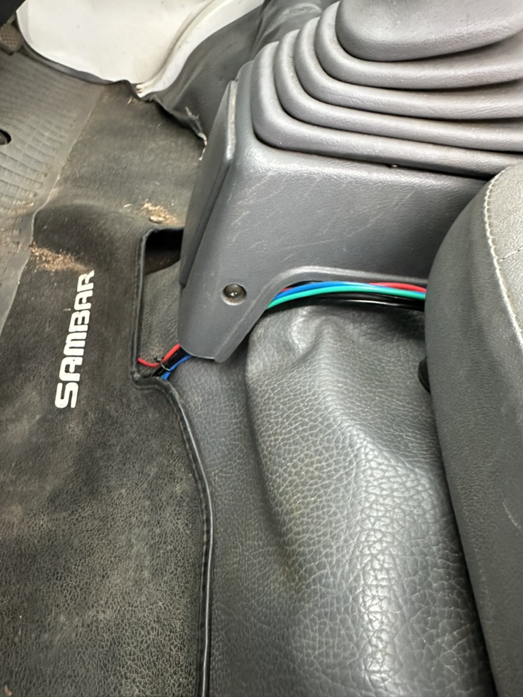
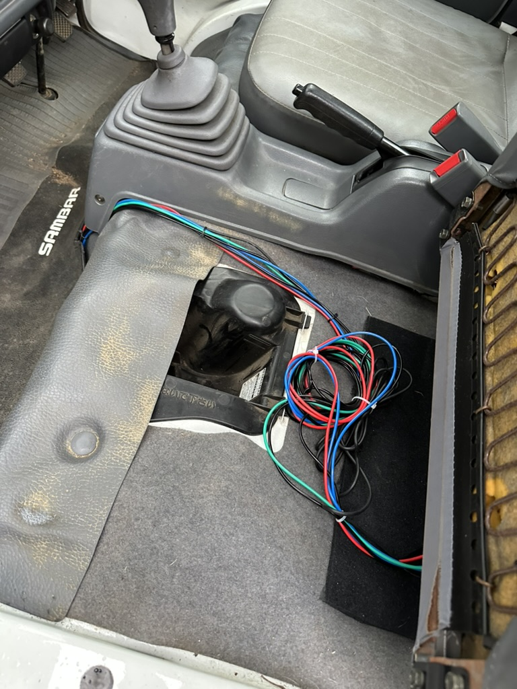
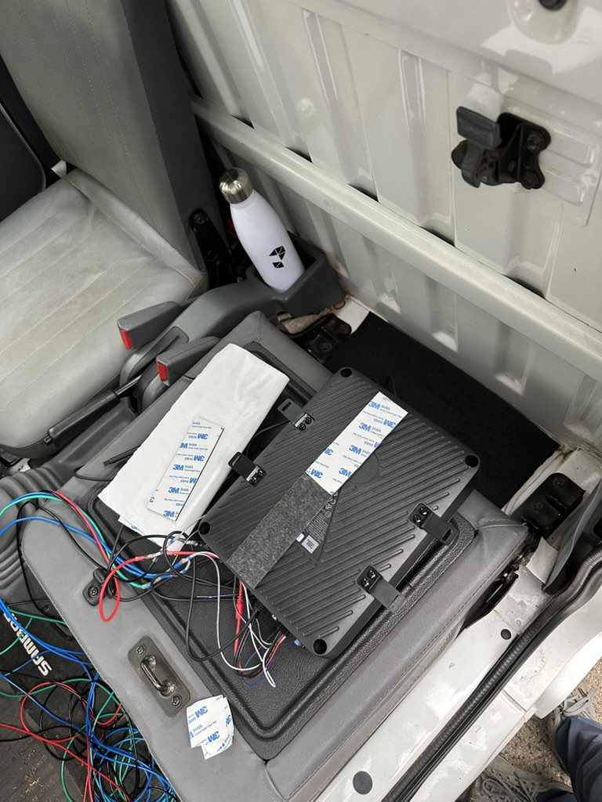
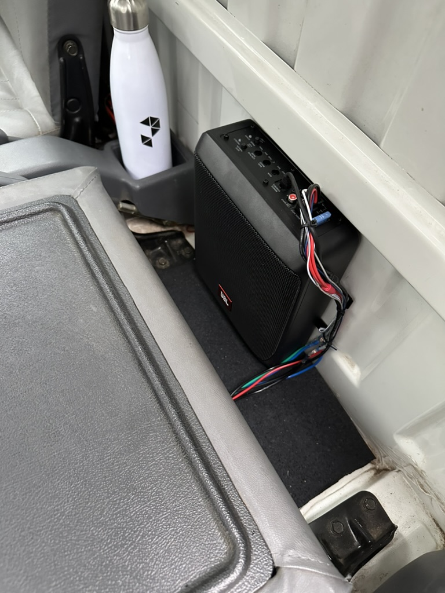

+++
date = '2026-03-27T00:00:00-04:00'
title = 'Subwoofer'
+++

After [upgrading the stereo](stereo), the sound was pretty tinny. The small 4x6 dash speakers don't provide much bass at their best, especially with no kind of enclosure. So I needed something to make the sound a bit richer.

Searching around for the smallest footprint I could find, I settled on the [JBL BassPro Nano](https://www.crutchfield.com/p_109BASPRON/JBL-BassPro-Nano.html).

Bottom line: it has been a huge upgrade to the sound. I'm still lacking some midrange, but that's a challenge for another day.

## Wiring 

Taking out the stereo and wiring things up was pretty straightforward. I used some t-taps to tap into power wiring feeding the stereo. I had unused rear speaker outputs so used those for the signal as I didn't have an appropriate length RCA cable handy.

I did my best to route the wires. Instead of popping off all the clips and routing the wires to be truly hidden, I just went under the floormat - which is honestly pretty decent - and under the passenger seat.

## Mounting

This turned out to be the hardest part. With just the thin back metal wall, I don't have anything to cleanly screw into. After some figuring, I did two things: 

  1. Put some hard rubber padding on the floor, so it could rest there
  2. Used several 2-sided foam tape squares to mount it to the back cab wall

Although that felt pretty secure at first, there was still a lot of rattling. I had to chase that down some and ultimately have jammed some more 2-sided foam tape squares around the edge. We're pretty good at the moment, but I think chasing some rattles will continue.

