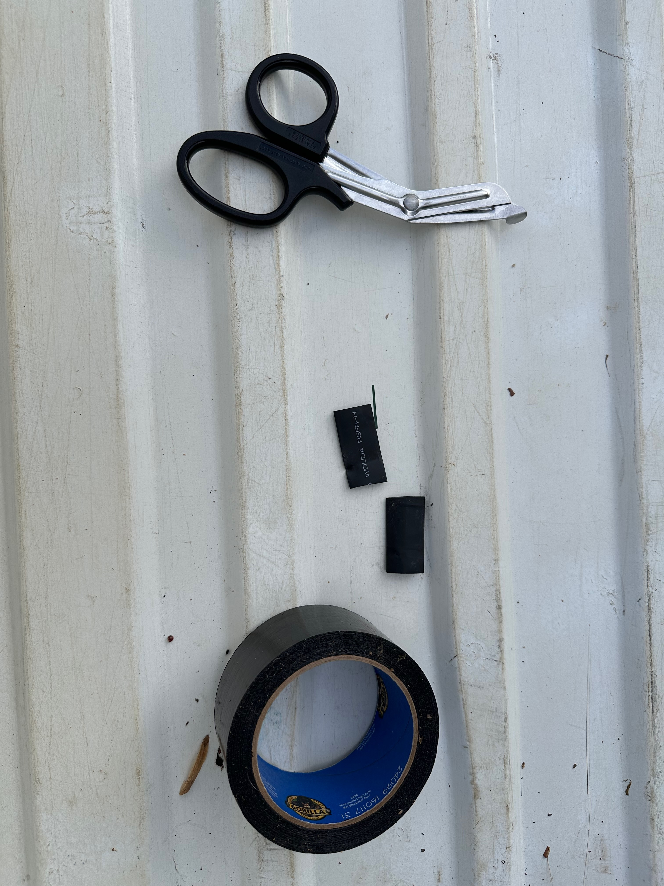
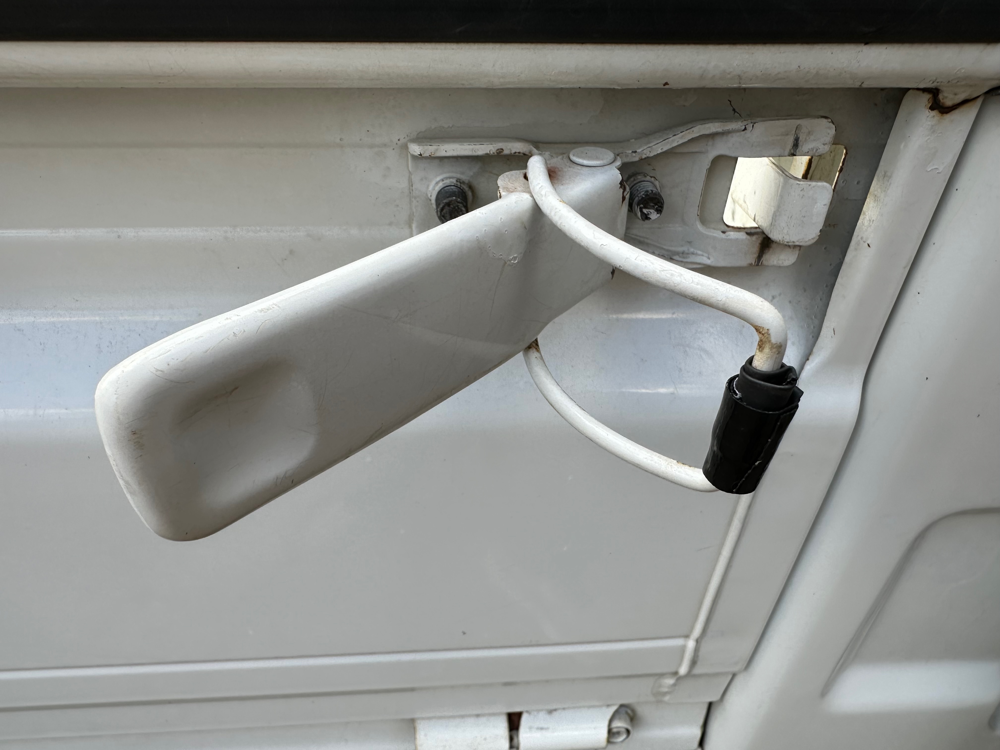

+++
date = '2026-01-11T00:00:00-04:00'
title = 'Temporary Gate Latch Silencer'
+++

Since I got the truck, it has had a pretty significant rattle on the right side. I quickly figured out that the front-right bed gate latch didn't sit super snug and was the culprit. More specifically, when the right bed side would move, the two components of the latch would hit each other.

The bed side does have a bumper on it which seems in fine shape. None of the latches have silencers, which are the small plastic parts that fit over the metal and tend to break off with age.

I plan to order [proper silencer replacements](https://ohkeigarage.com/store/ols/products/subaru-sambar-gate-lock-latch-silencer-plastic-clip-ks3-ks4/v/SBR-SMB-GT-LCK-BED-LTC) all around, but wanted an interim solution. Enter duct tape!

To avoid gunk long term, I didn't want to tape directly on the metal. Nearby I had some heat-shrink wire insulator - basically just some thin rubber. I cut that down a little, wrapping it on the inside and duct tape strips on the outside.

The result seems to work just fine for now, and definitely got rid of the very loud rattle.

