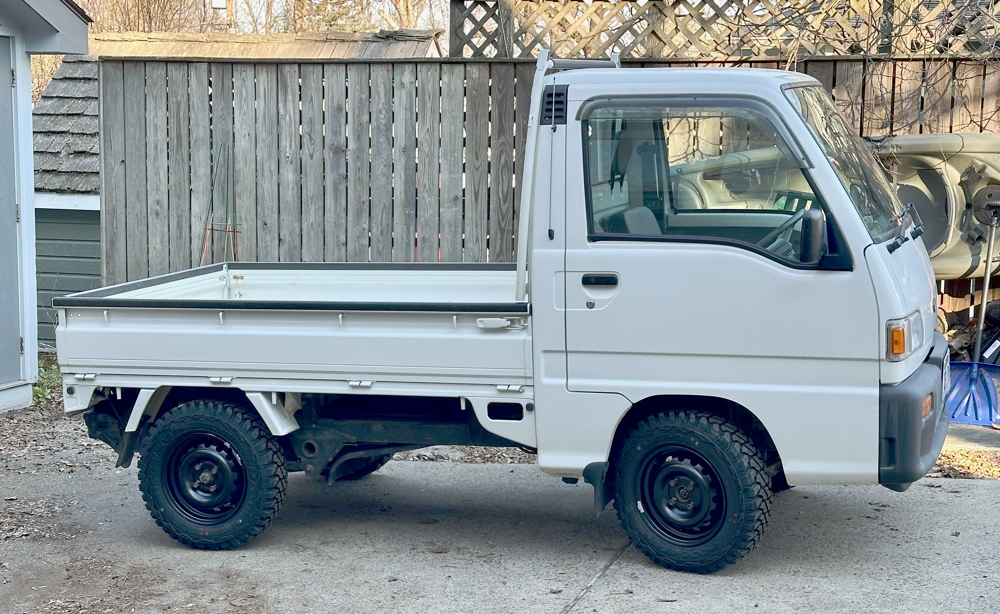
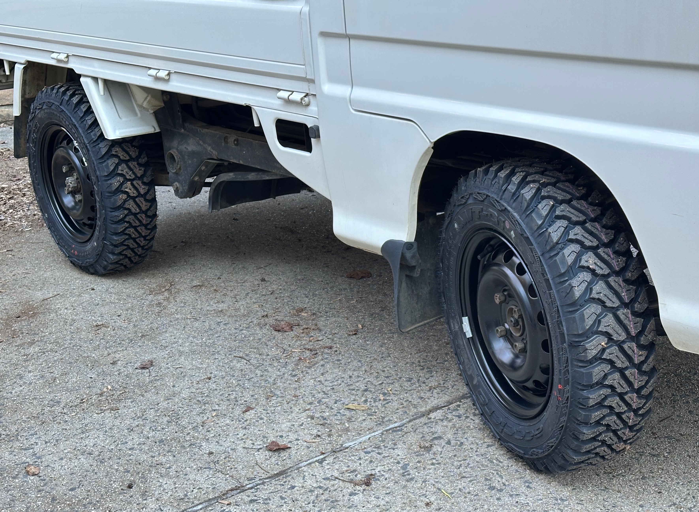
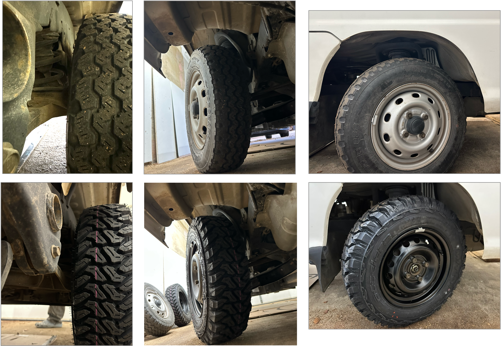

+++
date = '2026-01-03T00:00:00-04:00'
title = 'Wheels & Tires Upgrade'
+++

My new wheels & tires are installed! After lots of searching and learning about tire math, I settled on a more rugged look of all terrain tires, but was close to getting some more sporty white wheels and associated lower profile tires.

The details:

* __Wheels:__ Rtx Steel OE Style Wheel 13x5 4x100 Black, purchased from [BB Wheels](https://www.bbwheelsonline.com/rt-steel-wheel-x99108n-wheels-rims-13x5-4x100-black-40mm-x99108n/) ($390.22 for five wheels)
* __Tires:__ Accelera M/T-01 LT 165/80R13 94/93Q D, purchased from [Priority Tire](https://www.prioritytire.com/by-brand/accelera-tires/m-t-01?var-accelera=180776) ($379.65 for five tires)
* __Mounting:__ I took them to a local shop to get the tires mounted and balanced ($205 for the five)

The grand total cost was just under $1000 all-in.

These particular wheels were easy to fit as they were precisely the same 59.1mm center bore as stock.

_Side note: [this spreadsheet](https://docs.google.com/spreadsheets/d/1UREIP9V1JErYIgA6n1QdxHw5TulZbuJuxrhmcjaIOS8/edit?fbclid=IwAR2Ngg_ELxKER8OIyslGDsOfmWgCPKPyq02vCIrfMI_ryswOLb--tQGmXRc&gid=345319588#gid=345319588) was helpful in understanding wheel/tire fit for Sambars._

Everything seems to fit just fine with room to spare. The offset and width of the wheels seemed to match the factory wheels more or less, just going from 12" up to 13". The overall tire diameter is about an inch more.

I took a few close-up photos of the before & after to do my best to capture the clearance, though I wish I had lit the photos better.

